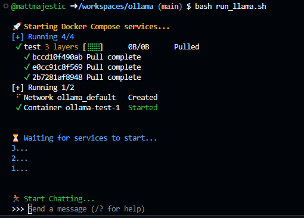

# 🦙 Free Ollama Chatbot with Docker Compose

Simply clone this repo with `git clone https://github.com/mattmajestic/ollama.git` and run `bash run_llama.sh` from terminal.

This will start the Ollama chatbot and you can start chatting with it in your terminal.

Here's how it looks:

Just type your messages at the prompt and press enter to chat with Ollama.